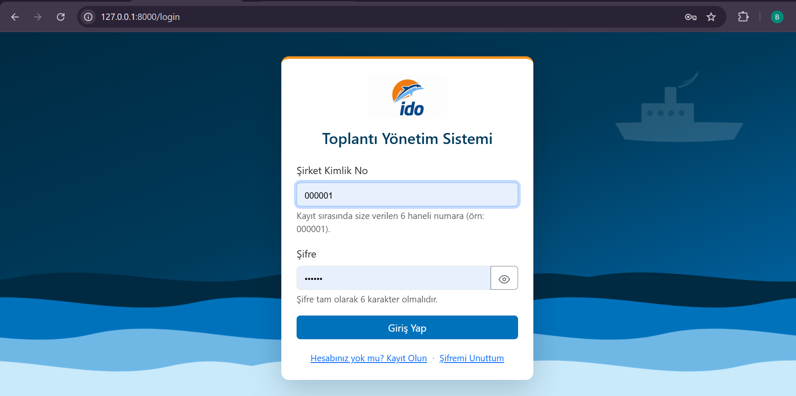
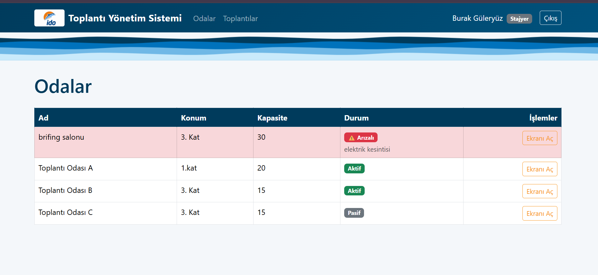
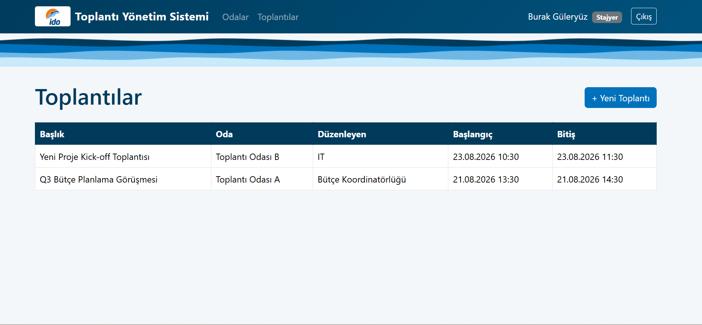
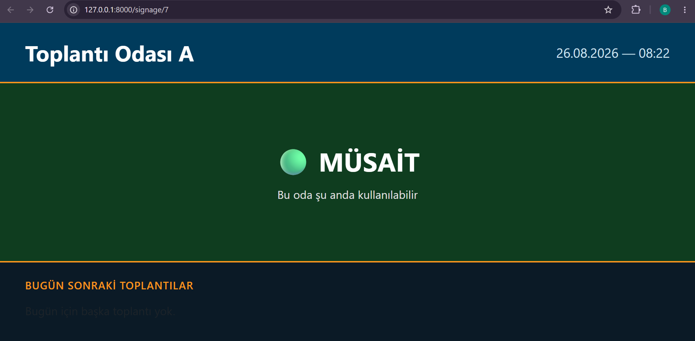

# 🛳️ Dijital Signage ve Toplantı Odası Yönetim Sistemi

> **İstanbul Deniz Otobüsleri (İDO)** — Bilgi Teknolojileri Birimi  
> Staj Projesi · Ağustos 2026 · Burak Güleryüz

---

## 📋 Proje Hakkında

Şirket içi toplantı odalarının rezervasyon, çakışma denetimi ve anlık doluluk gösteriminin tek bir rol tabanlı sistem üzerinden yönetilmesini sağlayan bir web uygulamasıdır.

**Çözülen problemler:**
- Aynı oda ve saatte birden fazla toplantı ayarlanabiliyordu **(çakışma)**
- Odaların doluluk durumu salonun önüne gelinmeden anlaşılamıyordu

---

## ✨ Özellikler

| Özellik | Açıklama |
|---|---|
| 🔒 Kimlik Doğrulama | Kimlik no + şifre ile giriş; bcrypt ile şifreleme |
| 👥 Rol Yönetimi | Personel, Stajyer, Bakım Sorumlusu, Özel Kalem Müdürü |
| 🚫 Çakışma Kontrolü | Aynı oda/saat çakışması otomatik engellenir |
| 📺 Brifing Ekranı | 60 sn'de bir yenilenen, şifresiz erişilebilir signage ekranı |
| 🔧 Arıza Modülü | Bakım sorumlusu oda arızasını işaretleyebilir |
| 📧 Acil Bildirim | Acil toplantılarda tüm kullanıcılara otomatik e-posta |
| 🏛️ Yönetim Kurulu | Gizli toplantı tipi; yalnızca yetkili rol görebilir |
| 🔑 Otomatik Kimlik No | Kayıtta 000001, 000002... formatında sıralı numara atanır |

---

## 🛠️ Teknolojiler


- **Backend:** PHP 8 · Laravel 12 · Eloquent ORM
- **Frontend:** Blade · Bootstrap 5 · JavaScript · SVG Animasyonlar
- **Veritabanı:** MySQL (XAMPP)
- **Araçlar:** Git · GitHub · Artisan CLI · Composer

---

## 🗄️ Veritabanı Yapısı

| Tablo | Önemli Alanlar |
|---|---|
| `users` | employee_id, name, password, role |
| `rooms` | name, location, capacity, is_active, is_faulty, fault_note |
| `meetings` | title, room_id, organizer, type, priority, start_time, end_time |

---

## 🚀 Kurulum

### Gereksinimler
- PHP 8.1+
- Composer
- MySQL (XAMPP önerilir)

### Adımlar

```bash
# 1. Repoyu klonla
git clone https://github.com/BurakGuleryuz/Brifing-salonu-sitesi-ido.git
cd Brifing-salonu-sitesi-ido

# 2. Bağımlılıkları kur
composer install

# 3. .env dosyasını oluştur
cp .env.example .env

# 4. Uygulama anahtarı üret
php artisan key:generate
```

`.env` dosyasında veritabanı ayarlarını düzenle:

```env
DB_CONNECTION=mysql
DB_HOST=127.0.0.1
DB_PORT=3306
DB_DATABASE=brifing_db
DB_USERNAME=root
DB_PASSWORD=
```

```bash
# 5. phpMyAdmin'den brifing_db adında veritabanı oluştur

# 6. Tabloları oluştur
php artisan migrate

# 7. Sunucuyu başlat
php artisan serve
```

Uygulama `http://127.0.0.1:8000` adresinde çalışır.

---

## 👤 Kullanıcı Oluşturma

`/register` sayfasından kayıt ol — kimlik numarası otomatik atanır (000001, 000002...).

Rol atamak için:

```bash
php artisan tinker
```

```php
App\Models\User::where('employee_id', '000001')->update(['role' => 'ozel_kalem_muduru']);
App\Models\User::where('employee_id', '000002')->update(['role' => 'bakim_sorumlusu']);
App\Models\User::where('employee_id', '000003')->update(['role' => 'personel']);
App\Models\User::where('employee_id', '000004')->update(['role' => 'stajyer']);
```

---

## 🔐 Rol Yetki Matrisi

| Rol | Toplantı Oluşturma | Düzenleme/Silme | Arıza Yönetimi |
|---|:---:|:---:|:---:|
| Stajyer | ❌ | ❌ | ❌ |
| Personel | ✅ | ❌ | ❌ |
| Bakım Sorumlusu | ❌ | ❌ | ✅ |
| Özel Kalem Müdürü | ✅ | ✅ | ✅ |

> Yönetim Kurulu toplantıları yalnızca Özel Kalem Müdürü tarafından görülebilir ve oluşturulabilir.

---

## 📺 Brifing (Signage) Ekranı Kullanımı

Her oda için ayrı bir URL vardır:

```
http://127.0.0.1:8000/signage/{oda_id}
```

Örnekler:
```
http://127.0.0.1:8000/signage/6
http://127.0.0.1:8000/signage/7
```

Bu URL'yi oda kapısındaki TV veya tablette **tam ekran** açık bırakın.

- ✅ Şifre **gerekmez**
- 🔄 60 saniyede bir **otomatik güncellenir**
- 🟢 Müsait / 🔴 Dolu / ⚠️ Arızalı durumunu renklerle gösterir
- Bugünün sonraki toplantılarını listeler

---

## 🏗️ Sistem Mimarisi

```
Tarayıcı
   ↓
Route (routes/web.php)
   ├── Herkese açık: /login, /register, /signage/{room}
   └── Korumalı (auth.simple): /rooms/*, /meetings/*
         ↓
   Middleware (EnsureUserIsLoggedIn)
         ↓
   ┌──────────────────────────────────┐
   │          Laravel MVC             │
   │  Views ←→ Controllers ←→ Models  │
   └──────────────────────────────────┘
         ↓
   MySQL Veritabanı
      ↙          ↘
Brifing Ekranı   Yönetim Paneli
(şifresiz, TV)   (rol bazlı)
```

---

## 📁 Proje Yapısı

```
brifing-site/
├── app/Http/Controllers/
│   ├── Auth/LoginController.php   # Giriş, kayıt, şifre sıfırlama
│   ├── RoomController.php         # Oda CRUD + arıza yönetimi
│   ├── MeetingController.php      # Toplantı CRUD + çakışma + mail
│   └── SignageController.php      # Brifing ekranı
├── app/Models/
│   ├── User.php                   # Roller, otomatik kimlik no
│   ├── Room.php                   # Aktif/pasif/arızalı durum
│   └── Meeting.php                # scopeOverlapping() çakışma kontrolü
├── resources/views/
│   ├── auth/                      # Giriş, kayıt, şifre sıfırlama
│   ├── rooms/                     # Oda yönetim ekranları
│   ├── meetings/                  # Toplantı yönetim ekranları
│   ├── signage/show.blade.php     # Brifing ekranı (TV için)
│   └── layouts/app.blade.php      # Ortak layout + animasyonlar
├── docs/screenshots/              # Ekran görüntüleri
└── routes/web.php
```

---

## 📸 Ekran Görüntüleri

### Giriş Ekranı


### Odalar Yönetim Paneli


### Toplantılar Listesi


### Brifing Ekranı


---

## 📄 Lisans

Bu proje İDO (İstanbul Deniz Otobüsleri) bünyesinde staj kapsamında geliştirilmiştir.

---

<div align="center">
  <sub>Geliştirici: <a href="https://github.com/BurakGuleryuz">Burak Güleryüz</a> · Bilgisayar Mühendisliği Stajyeri · 2026</sub>
</div>
